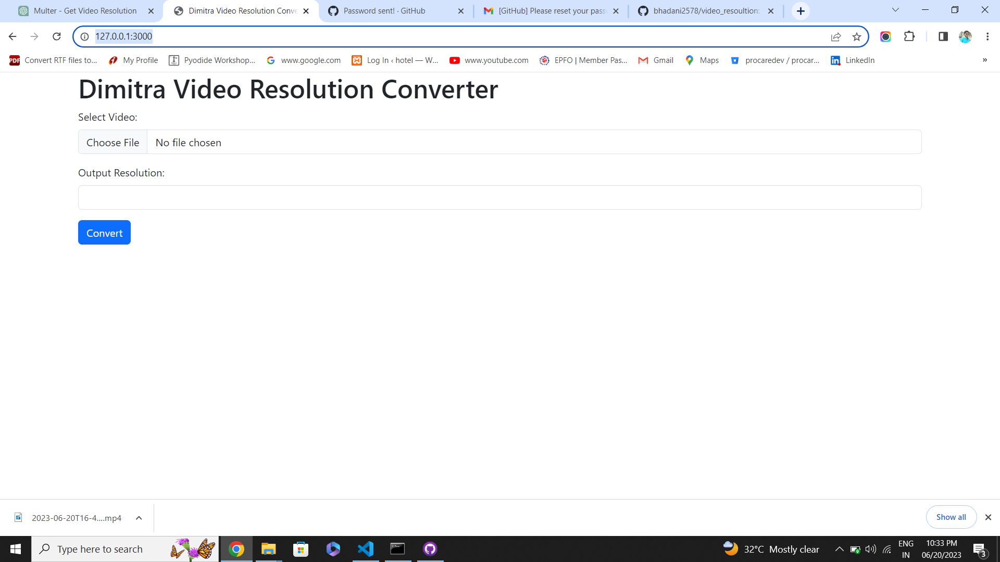

# video_resoultion
video resolution converter

I used a express, multer and ffmpeg for the convert video

Project start command: node index.js

user can select a video and give output resolution value and then click convert.

Then download the video as converted resoultion also in nodejs console log you can check source resoultion and converted resoultion.

url:- http://127.0.0.1:3000/

